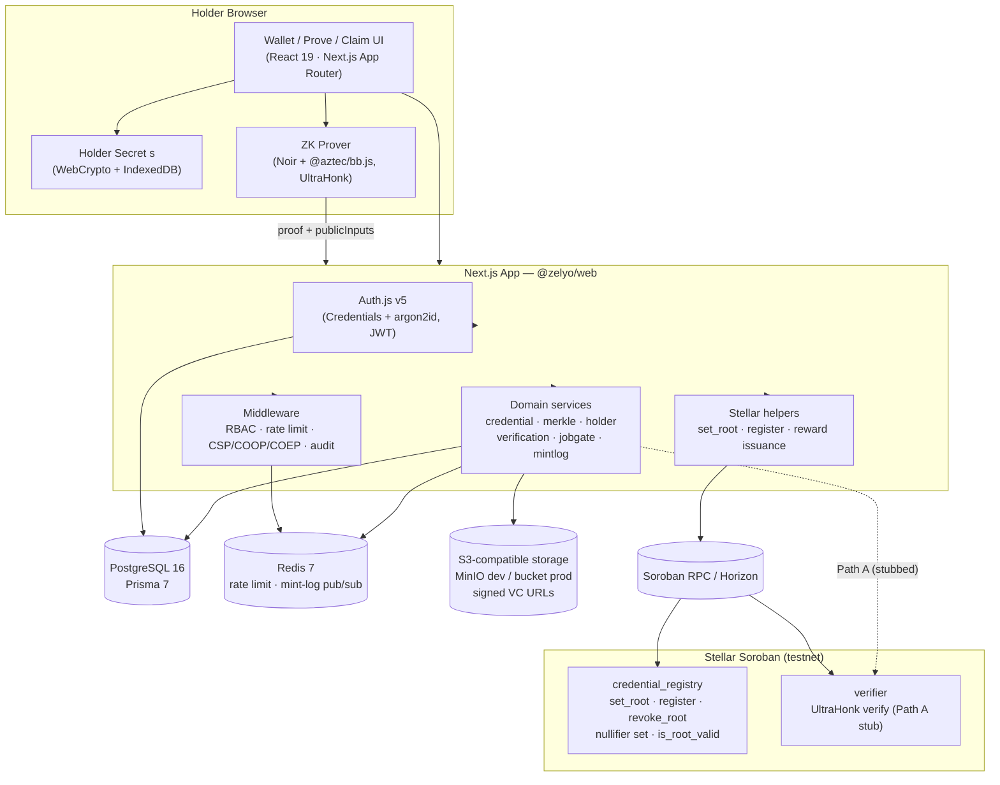
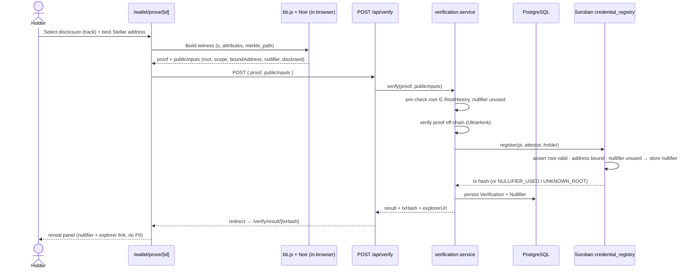
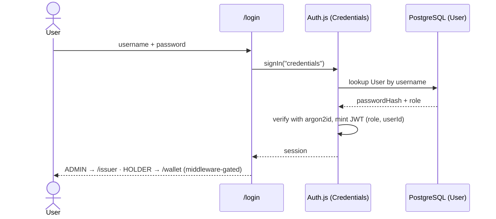
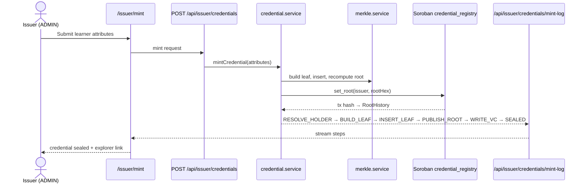

# Zelyo

> Verifiable credentials, sealed with zero-knowledge proofs — prove one fact without revealing who you are.

Zelyo is a privacy-preserving verifiable-credentials protocol built on **Stellar Soroban** smart contracts and **Noir** zero-knowledge circuits. An issuer (e.g. a university or bootcamp) mints a credential to a learner as a leaf in a Merkle tree and anchors the tree's root on-chain; the holder then generates a zero-knowledge proof **in their own browser** that proves a single fact about that credential — "I hold a credential on track *Data Engineering*" — while the underlying name, grade, and dates never leave their device. A verifier (an employer, a job gate, a marketplace) confirms the proof, and the only things ever written to Stellar are a **nullifier** (a one-time, unlinkable spend-token) and the holder's **bound wallet address**. No personal data, no document, and no secret is ever recorded on-chain. The hero flow is: **mint → prove one fact in-browser → verify → unlock a Stellar-native reward**, with the holder cryptographically Sybil-blocked from claiming twice.

For the **Stellar ecosystem**, Zelyo is a native identity-and-reputation primitive that showcases Soroban beyond payments: it demonstrates on-chain Merkle-root anchoring, deterministic nullifier uniqueness (Sybil resistance), and wallet-bound selective disclosure as reusable building blocks. If adopted, this same "prove one attribute, reveal nothing else" layer can gate airdrops and reward campaigns without bots, provide reusable-KYC style attestations that plug into Stellar anchors, and give DAOs, DeFi protocols, and marketplaces on Stellar a privacy-first way to check eligibility — an identity layer the network currently lacks. Zelyo turns "hand over your whole document" into "present a cryptographic proof of exactly one fact, bound to your wallet, usable once."

| | |
| --- | --- |
| **Status** | `0.0.0` · pre-release / hackathon-stage MVP. Core mint→prove→verify→claim spine works end-to-end; see [Current State](#-current-state) for what is complete vs. in progress. |
| **License** | No `LICENSE` file present in the repo — `[PLACEHOLDER: license]` |
| **Monorepo** | pnpm workspaces (`apps/*`, `packages/*`) |
| **App stack** | Next.js 16.2 · React 19.2 · TypeScript 6.0 · TailwindCSS 4.3 |
| **ZK stack** | Noir 1.0.0-beta.22 · Barretenberg `@aztec/bb.js` (UltraHonk) · BN254 Poseidon2 |
| **Chain** | Stellar Soroban (testnet) · `soroban-sdk` 26 · Rust 1.92 |
| **CI/CD** | GitHub Actions (`ci.yml`, `e2e.yml`) → Railway (Nixpacks) |
| **Live demo** | `[PLACEHOLDER: live app URL]` |

---

## 🚨 Problem

Proving a fact about yourself today is all-or-nothing:

- **Over-disclosure** — proving "I completed this program" means handing over the whole diploma, transcript, or ID.
- **Centralized honeypots** — every platform that verifies credentials ends up storing the PII, becoming a breach target.
- **No reuse without doxxing** — stopping the same credential from being used twice normally requires linking submissions back to a real identity.
- **No user control** — once a document is shared, the holder can't limit what a verifier learns or keeps.

## 🌟 Vision

Credentials that are **portable, private, and provable**: the holder controls the secret, only the disclosed attribute leaves the device, and any issuer / verifier / reward gate can compose on top. Zelyo aims to be the privacy-preserving identity layer for the future of work — and a reusable attestation primitive for the wider Stellar ecosystem.

## 👥 Target Users

| User | Why Zelyo? |
| --- | --- |
| **Issuers** (universities, bootcamps, certifiers) | Mint credentials as Merkle leaves and publish roots on-chain — no database of personal details to run or leak. |
| **Holders** (freelancers, remote workers, learners) | Keep credentials + the holder secret client-side; reveal only the one attribute an opportunity requires. |
| **Verifiers** (employers, job gates, DAOs, marketplaces) | Confirm a claim cryptographically with zero PII liability and no manual review. |
| **Developers** | Extend the protocol with new gates, credentials, and reward types on the ZK + Soroban scaffold. |

---

## ✅ Current State

Honest snapshot of what is implemented on `develop` versus what is partial or planned. Grounded in the codebase and [`docs/REMAINING_TASKS.md`](./docs/REMAINING_TASKS.md).

### Working end-to-end
- **Issuer mint** — credential → `Poseidon` leaf → Merkle insert (`@zk-kit/imt`) → **root published on-chain** via `credential_registry.set_root` → VC written to S3-compatible storage, with a live mint log streamed over SSE.
- **Holder key management** — secret `s` generated in-browser (WebCrypto), AES-GCM encrypted in IndexedDB, backup/restore; only `idCommitment = Poseidon(s)` is ever sent to the server.
- **In-browser proving** — Noir + `@aztec/bb.js` UltraHonk proof generated client-side (COOP/COEP isolation); no server sees the witness.
- **Verification (Path B)** — `/api/verify` verifies the proof off-chain, then calls `credential_registry.register` to enforce root validity, nullifier uniqueness, and address binding on-chain; result mirrored to Postgres and surfaced at `/verify/result/[txHash]` with a Stellar Expert link.
- **Sybil resistance** — deterministic `nullifier = Poseidon(s, scope)` stored on-chain; a replay returns `NULLIFIER_USED`.
- **Issuer gate creation** (`/issuer/gates`) and a public **job board** (`/jobs`, `/jobs/[slug]`) with predicate-matched gates.
- **Revocation** — `credential_registry.revoke_root` is implemented with contract tests (SPEC "Could" — done).
- **Hardening** — centralized CSP/COOP/COEP/HSTS headers, per-route Redis rate limiting, PII-safe audit logging, WCAG A/AA a11y specs.

### Partial / in progress (tracked as issues)
- **Selective disclosure is `track`-only.** The Noir circuit (`circuits/zelyo_credential/src/main.nr`) currently binds a single `disclosed = Poseidon(track)`, but the prove UI and gate form expose all five attributes — gates on grade/date/etc. are not yet claimable. Noir source **is** in the repo, so this is recompilable. → [#105](https://github.com/webnxt-2030/zelyo/issues/105)
- **Reward delivery is incomplete.** A claim currently *locks* a claimable balance but there is no claim-the-balance step, and native XLM can't be selected through the gate form. So the money-rails reveal doesn't yet put spendable funds in the holder's wallet. → [#103](https://github.com/webnxt-2030/zelyo/issues/103), [#104](https://github.com/webnxt-2030/zelyo/issues/104)
- **Acceptance reveal 13.1 is red in CI** (prove→verify redirect timeout); reveal 13.2 (Sybil) sits downstream and is unverified in CI. → [#101](https://github.com/webnxt-2030/zelyo/issues/101), [#102](https://github.com/webnxt-2030/zelyo/issues/102)

### Planned / stubbed
- **Path A (fully on-chain ZK verification)** — the `verifier` contract and `verify_and_register` are wired but stubbed; the active path is Path B (server-side verify + on-chain register). Blocked on Soroban pairing/host-function support and a real embedded verification key.
- **`/admin/users`** page (SPEC §5) not yet implemented.

---

## 🏛️ Architecture



## 🔀 Sequence Diagrams

### 1. Hero flow — prove one fact & verify (Path B, current default)



### 2. Auth & role redirect



### 3. Issuer mint with live SSE log



### 4. Claim a gated reward

```mermaid
sequenceDiagram
    actor Holder
    participant Result as /verify/result/[txHash]
    participant Job as /jobs/[slug]
    participant API as POST /api/jobboard/gates/[slug]/claim
    participant JSvc as jobgate.service
    participant Stellar as stellar.ts (reward)
    participant DB as PostgreSQL (GateClaim)

    Holder->>Result: successful reveal → "Claim your reward"
    Holder->>Job: open gate (carries txHash / nullifier / address)
    Holder->>API: claim
    API->>JSvc: claimGate(gate, nullifier)
    JSvc->>DB: verification exists? disclosed == predicate? not already claimed?
    JSvc->>Stellar: issue reward (claimable balance / verified flag)
    Note over Stellar,Holder: balance is locked on-chain; claim-the-balance step still pending (#104)
    Stellar-->>JSvc: reward tx hash
    JSvc->>DB: persist GateClaim
    JSvc-->>API: result
    API-->>Holder: "Reward Unlocked" + explorer link
```

## 📜 Smart Contracts

Rust workspace under [`contracts/`](./contracts) (`soroban-sdk` 26, Rust 1.92, target `wasm32-unknown-unknown`).

| Crate | Purpose | Public functions |
| --- | --- | --- |
| `credential_registry` | On-chain registry of issuer Merkle roots, nullifier uniqueness, and holder address binding — the trust anchor. | `initialize`, `set_root`, `is_root_valid`, `register` (Path B), `is_nullifier_used`, `verify_and_register` (Path A, stubbed), `revoke_root` |
| `verifier` | Cross-contract UltraHonk proof verifier for future fully-on-chain verification (Path A). | `verify(proof, public_inputs) -> bool` (stub) |

<!-- PLACEHOLDER: Soroban smart contracts — document each contract's public functions, parameters, storage keys, events, and deployment/upload process here. -->

## 🔐 ZK Circuit

`circuits/zelyo_credential/` (Noir 1.0.0-beta.22, depth-20 Merkle, Poseidon2 over BN254).

- **Private inputs:** holder secret `s`, credential attributes (`track`, `grade`, `issue_date`), Merkle path.
- **Public inputs:** `root`, `scope = Hash(app_id | chain_id | registry_id)`, `bound_address` (field-packed Stellar pubkey), `nullifier`, `disclosed`.
- **Constraints:** Merkle inclusion (`leaf = Poseidon(Poseidon(s), Poseidon(attributes))`), `nullifier == Poseidon(s, scope)`, `disclosed == Poseidon(track)`, non-zero address binding.
- **Parity:** the JS leaf/nullifier builders in [`packages/zk-shared`](./packages/zk-shared) are bit-for-bit verified against the circuit (`packages/zk-shared/test/parity.test.ts`).

> Current limitation: exactly one attribute (`track`) is disclosable. Multi-attribute disclosure requires a disclosure-mask input + recompile — tracked in [#105](https://github.com/webnxt-2030/zelyo/issues/105).

## 🛠️ Tech Stack

| Layer | Technology |
| --- | --- |
| **Frontend** | Next.js 16.2, React 19.2, TypeScript 6.0.3, TailwindCSS 4.3 |
| **Auth** | Auth.js v5 (`next-auth@5` beta), Credentials provider, `@node-rs/argon2` (argon2id), JWT sessions |
| **Database** | PostgreSQL 16, Prisma 7.8, `@prisma/adapter-pg` |
| **Cache / rate limit / pub-sub** | Redis 7, `ioredis`, `rate-limiter-flexible` |
| **Object storage** | `@aws-sdk/client-s3` — MinIO (dev), S3-compatible bucket (prod) |
| **Smart contracts** | Rust 1.92, `soroban-sdk` 26, `wasm32-unknown-unknown` |
| **Zero knowledge** | Noir 1.0.0-beta.22, `@noir-lang/noir_js`, `@aztec/bb.js` (UltraHonk), `@zk-kit/imt` |
| **ZK shared lib** | `@zelyo/zk-shared` — Poseidon2 (`@zkpassport/poseidon2`) + BN254 field math |
| **Validation / logging** | Zod 4, `pino` + `pino-http` |
| **Tooling / test** | pnpm 10.33, Node 22, ESLint 9, Vitest 4, Playwright + `@axe-core/playwright` |
| **Hosting** | Railway (Nixpacks builder) |

## 🚀 Run Locally

### Prerequisites
- Node.js `>=22`, pnpm `10.33`
- Docker + Docker Compose
- Rust `1.92` with `wasm32-unknown-unknown` + Stellar CLI *(only needed to build/deploy contracts)*
- Noir `nargo` 1.0.0-beta.22 + Barretenberg `bb` *(only needed to rebuild the circuit)* — see [`docs/toolchain.md`](./docs/toolchain.md)

```bash
# 1. Install
git clone [PLACEHOLDER: repo URL] && cd zelyo && pnpm install

# 2. Local infra (Postgres 16, Redis 7, MinIO + zelyo bucket)
docker compose up -d

# 3. Environment
cp .env.example .env   # set AUTH_SECRET, ADMIN_PASSWORD, ISSUER_SECRET, ISSUER_STELLAR_ACCOUNT

# 4. Migrate + seed (admin, issuer, empty depth-20 tree, data-engineering gate)
pnpm --filter @zelyo/web db:migrate
pnpm --filter @zelyo/web db:seed

# 5. Run
pnpm dev   # http://localhost:3000
```

**Required** env vars (app won't boot without them): `APP_URL`, `AUTH_SECRET`, `AUTH_URL`, `DATABASE_URL`/`DIRECT_URL`, `REDIS_URL`, `S3_*`, `STELLAR_NETWORK`, `NETWORK_PASSPHRASE`, `SOROBAN_RPC_URL`, `HORIZON_URL`, `ISSUER_SECRET`, `ISSUER_STELLAR_ACCOUNT`, `ADMIN_USERNAME`, `ADMIN_PASSWORD`, `ISSUER_NAME`.

**Optional / degrade gracefully:**

| Variable | If unset |
| --- | --- |
| `CREDENTIAL_REGISTRY_CONTRACT_ID`, `VERIFIER_CONTRACT_ID` | On-chain root publish / register can't run until populated after `pnpm contracts:deploy`. |
| `ZK_VERIFY_MODE` | Defaults to `server` (Path B). `onchain` selects the staged Path A flow. |
| `ZK_SCOPE_APP_ID` | Domain separator folded into scope/nullifier; has a dev default. |
| `CIRCUIT_ARTIFACT_BASE` | Defaults to `/circuit`; requires `pnpm zk:build` artifacts to be present. |
| `NEXT_PUBLIC_EXPLORER_BASE` | Only browser-exposed var; builds Stellar Expert links. |

Optional build steps: `pnpm contracts:build && pnpm contracts:deploy` (once per network), `pnpm zk:build` (compile circuit → `apps/web/public/circuit`).

## ☁️ Deployment

Railway via `railway.json` (Nixpacks) + `nixpacks.toml` (Node 22 / pnpm 10):

- **Build:** `pnpm i --frozen-lockfile && pnpm --filter @zelyo/web prisma generate && pnpm --filter @zelyo/web build`
- **Pre-deploy:** `prisma migrate deploy && prisma db seed` (idempotent)
- **Start:** `pnpm --filter @zelyo/web start` · **Health check:** `/api/health`

Services: Web (this repo), PostgreSQL, Redis, and an S3-compatible bucket. All secrets live in Railway; the only public client var is `NEXT_PUBLIC_EXPLORER_BASE`. Contracts are deployed separately (never during the web release). Full runbook: [`docs/DEPLOY.md`](./docs/DEPLOY.md).

- **Live app:** `[PLACEHOLDER: live app URL]`

## 🎥 Demo

- **Live app:** `[PLACEHOLDER: live app URL]`
- **Video walkthrough:** `[PLACEHOLDER: demo video URL]`
- **Screenshot:** `[PLACEHOLDER: screenshot]`

Local demo path: log in as admin (`/login`) → mint (`/issuer/mint`) → back up holder secret (`/wallet/keys`) → prove (`/wallet/prove/[id]`) → result (`/verify/result/[txHash]`) → claim (`/jobs/[slug]`).

## 👋 Team

| Name | Role | Contact |
| --- | --- | --- |
| `[PLACEHOLDER: name]` | `[PLACEHOLDER: role]` | `[PLACEHOLDER: contact]` |
| `[PLACEHOLDER: name]` | `[PLACEHOLDER: role]` | `[PLACEHOLDER: contact]` |

## 📄 License

No `LICENSE` file is present in the repository. `[PLACEHOLDER: license name]`

---

## 📚 Further Reading
- [`SPEC.md`](./SPEC.md) — full application specification (pages, ZK layer, contracts, data model, acceptance criteria).
- [`BRAND.md`](./BRAND.md) — design system.
- [`LOGO.md`](./LOGO.md) — logo image-generation prompts.
- [`docs/REMAINING_TASKS.md`](./docs/REMAINING_TASKS.md) — outstanding work and known gaps.
- [`docs/DEPLOY.md`](./docs/DEPLOY.md) · [`docs/toolchain.md`](./docs/toolchain.md) — deploy + local toolchain runbooks.
