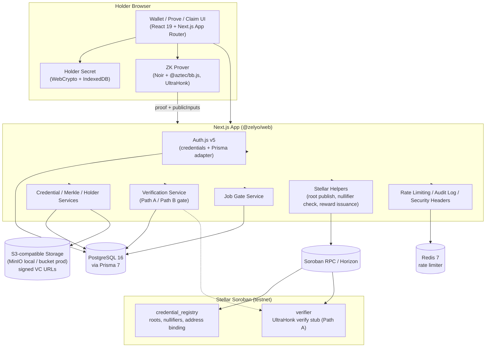
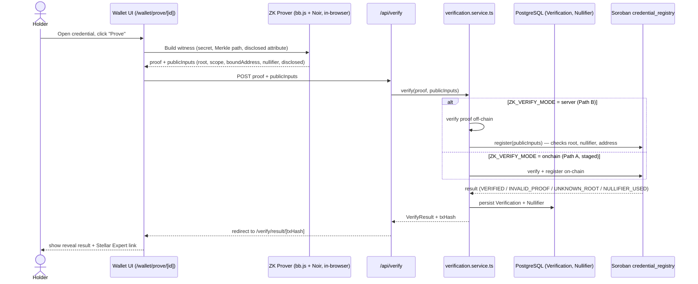
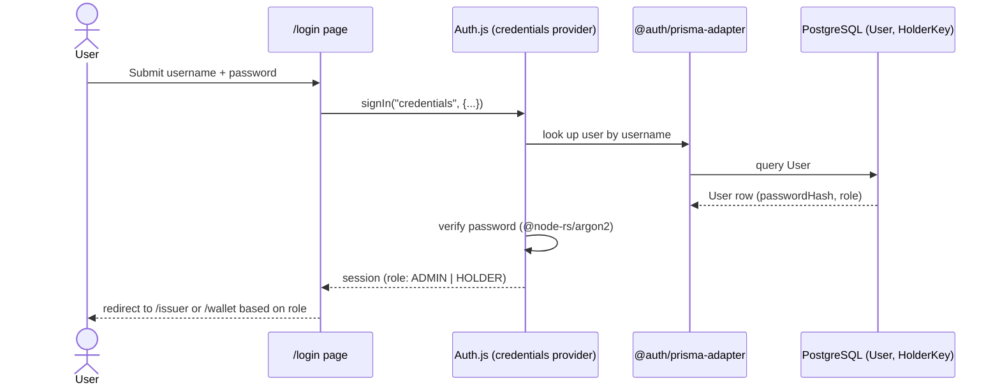
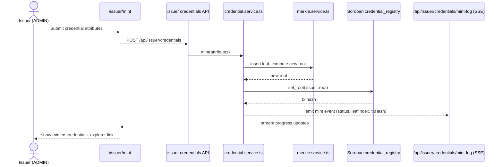
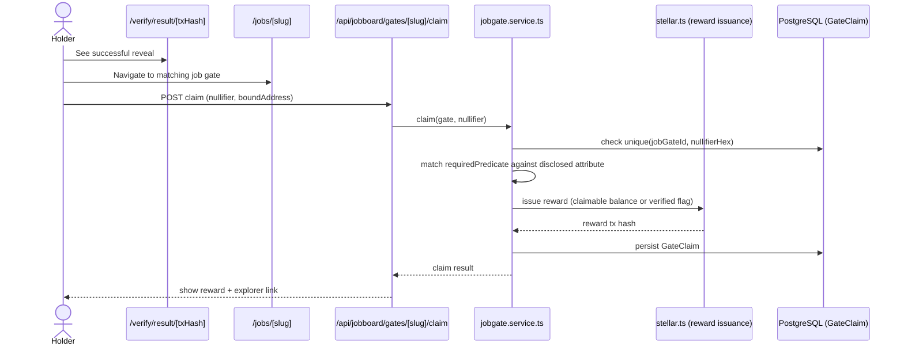

# Zelyo

> Verifiable credentials, sealed with zero-knowledge proofs — prove one fact without revealing who you are.

Zelyo is a privacy-preserving credential protocol built on **Stellar Soroban** smart contracts and **Noir** zero-knowledge circuits. Issuers mint credentials into an on-chain Merkle tree, holders generate a zero-knowledge proof entirely in their browser, and verifiers confirm a single disclosed attribute (e.g. `track`) — all without a name, document, or secret ever touching the chain or a server. The hero flow: an issuer mints a credential → a holder proves one fact about it in-browser → a verifier/job board confirms the proof and releases a gated reward, all bound to the holder's Stellar wallet and protected against reuse by a deterministic nullifier.

---

## Status

| | |
| --- | --- |
| **Version** | `0.0.0` (pre-release, private monorepo) |
| **Branch model** | `main` (production-ready) / `develop` (integration) / `feat|fix|docs/...` (feature branches) |
| **License** | No `LICENSE` file found in the repository — `[PLACEHOLDER: license]` [inferred: unlicensed / all-rights-reserved by default] |
| **CI** | GitHub Actions — `ci.yml` (PR gate) and `e2e.yml` (acceptance, push to `develop`) |
| **Hosting** | Railway (Nixpacks builder) |

---

## Problem

*No `SPEC.md` exists in this repository; the problem statement below is grounded in `docs/features.md`, `docs/REMAINING_TASKS.md`, and the shipped product surface.*

Identity and credential verification today force an all-or-nothing disclosure:

- **Over-disclosure** — proving a single fact (e.g. "I completed this program") requires handing over an entire document, resume, or ID.
- **Centralized honeypots** — platforms that verify credentials must store the underlying PII, becoming breach targets.
- **No reuse protection without doxxing** — systems that want to stop the same credential being used twice normally need to link submissions back to a real identity.
- **No user control** — once a document is shared, the holder has no way to limit what a verifier learns or retains.

## Vision / Purpose

Zelyo replaces "trust me, here is everything" with "here is a cryptographic proof of exactly one fact," bound to a wallet, usable once per scope, and never tied to a name on-chain. Per `docs/features.md`, the project is built and shipped in phases (Phase 0 spike through Phase 7 hardening), giving developers, issuers, and platforms a full-stack starter kit for:

1. Issuing a credential and anchoring its Merkle root on-chain (`credential_registry` Soroban contract).
2. Letting a holder generate an UltraHonk zero-knowledge proof client-side (Noir + `@aztec/bb.js`).
3. Verifying the proof server-side today, with an on-chain verification path (`verifier` contract) staged for later (`ZK_VERIFY_MODE`, Path A vs. Path B — see `docs/superpowers/decisions/`).
4. Letting the holder claim a gated reward with that proof, without revealing more than the one disclosed attribute.

The chain records only a **nullifier** and, where applicable, a **field-packed bound wallet address** — never the holder's name, full credential, or secret.

## Target Users

| User | Why Zelyo? |
| --- | --- |
| **Issuers** (universities, bootcamps, certifiers) | Mint credentials as Merkle-tree leaves and publish roots on-chain without running a database of personal details. |
| **Holders** (freelancers, remote workers, professionals) | Store credentials locally, keep the holder secret client-side, and reveal only what a specific opportunity requires. |
| **Verifiers** (employers, marketplaces, DAOs) | Confirm a single claim cryptographically, with no PII liability and no manual document review. |
| **Developers** | Extend the protocol via the ZK circuit, Soroban contracts, and the `@zelyo/zk-shared` package. |

## Features

Grouped by the actual implemented surface in `apps/web/src/app`, `src/server`, `contracts/`, and `circuits/`:

### Credential Lifecycle
- Issuer minting dashboard (`/issuer`, `/issuer/mint`, `/issuer/credentials`) backed by `credential.service.ts` — mint, revoke, and list credentials.
- Merkle-tree registry: leaf insertion and root computation via `merkle.service.ts` (`@zk-kit/imt`), with roots anchored on Soroban through `credential_registry::set_root`.
- Live mint feed via Server-Sent Events (`/api/issuer/credentials/mint-log`, `mintlog.ts`).
- Holder wallet (`/wallet`, `/wallet/credentials/[id]`): encrypted credential ("VC") files served via short-lived signed S3 URLs (`storage.ts`).
- Local secret management (`/wallet/keys`, `holder-key.client.ts`): the holder secret is generated with WebCrypto, AES-GCM encrypted, and persisted in IndexedDB — never sent to the server.

### Zero-Knowledge Proving
- In-browser UltraHonk proof generation (`prover.client.ts`, `@aztec/bb.js` + `@noir-lang/noir_js`) at `/wallet/prove/[id]`; no server ever sees the witness.
- Selective disclosure: the Noir circuit (`circuits/zelyo_credential/src/main.nr`) opens exactly one attribute (`track`) while grade/issue-date stay hidden.
- Address binding: proofs are bound to a Stellar public key packed into a field element, preventing credential transfer.
- Sybil resistance: a deterministic nullifier (`Poseidon(secret, scope)`) blocks the same credential/scope pair from registering twice, enforced both in the circuit and in `credential_registry::register`.

### Verification & Rewards
- Server-side verification (`/api/verify`, `verification.service.ts`) — the current default (`ZK_VERIFY_MODE=server`, "Path B"): proof is checked off-chain and the result mirrored to the Soroban registry.
- On-chain verifier contract stub (`contracts/verifier`) wired for a future "Path A" fully on-chain UltraHonk verification.
- Gated job board (`/jobs`, `/jobs/[slug]`, `jobgate.service.ts`): predicate-matched gates that release a claimable balance or a verified flag on successful reveal (`stellar.ts` reward issuance).
- Explorer links on every on-chain action (`explorer.ts` → Stellar Expert testnet), so users can audit exactly what is (and isn't) recorded.

### Hardening & Quality
- Centralized security headers (`security-headers.ts`): CSP with nonce + `strict-dynamic`, COOP/COEP (required for `bb.js` WASM threading), HSTS, X-Frame-Options, referrer/permissions policies.
- Per-route rate limiting via `rate-limit.ts` (`rate-limiter-flexible` + Redis): named limiters for auth, verify, register, mint, and claim endpoints.
- PII-safe audit logging (`audit.ts`, `AuditLog` model): only hashes, nullifiers, tx hashes, and result codes are stored.
- Accessibility floor: Playwright + `@axe-core/playwright` WCAG A/AA specs.
- Test coverage: Vitest unit tests (web app + `@zelyo/zk-shared`), Playwright e2e/acceptance specs, and Noir/Rust circuit and contract tests.

## Architecture



## Sequence Diagrams

### 1. Hero flow — prove & verify a credential



### 2. Auth flow — login



### 3. Async event flow — issuer mint with live log



### 4. Claim flow — gated reward



## Smart Contracts

Contract crates found under `contracts/` (Rust workspace, `soroban-sdk` 26, Rust 1.92.0 pinned, target `wasm32-unknown-unknown`):

| Crate | Purpose (inferred from source) |
| --- | --- |
| `credential_registry` | On-chain registry for issuer Merkle roots, nullifier uniqueness, and optional holder-address binding. Entrypoints: `initialize`, `set_root`, `is_root_valid`, `register`. |
| `verifier` | Cross-contract UltraHonk proof verifier for the future fully on-chain path ("Path A"). Entrypoint: `verify`. Currently a stub — the active path ("Path B") verifies proofs server-side and mirrors the result to `credential_registry`. |

<!-- PLACEHOLDER: Soroban smart contracts — document each contract's purpose, public functions, parameters, and deployment/upload process here. -->

## Tech Stack

### Frontend
- Next.js 16.2.0, React 19.2.0, React DOM 19.2.0
- TypeScript 6.0.3
- TailwindCSS 4.3.0, `@tailwindcss/forms` 0.5.10, `@tailwindcss/postcss` 4.3.0
- `react-hook-form` 7.54.0, `@hookform/resolvers` 5.4.0, `zod` 4.4.3

### Backend / Auth / Data
- `next-auth` 5.0.0-beta.25 with `@auth/prisma-adapter` 2.7.4
- `@prisma/client` 7.8.0 / `prisma` 7.8.0 / `@prisma/adapter-pg` 7.8.0
- PostgreSQL 16 (local via Docker Compose)
- `ioredis` 5.4.1, `rate-limiter-flexible` 11.0.0, Redis 7
- `@node-rs/argon2` 2.0.2 (password hashing)
- `pino` 10.0.0 / `pino-http` 11.0.0 (logging)
- `@aws-sdk/client-s3` 3.700.0, `@aws-sdk/s3-request-presigner` 3.700.0 (MinIO locally, S3-compatible bucket in prod)

### Blockchain
- `@stellar/stellar-sdk` 16.0.1
- Stellar Soroban (testnet), Soroban RPC + Horizon

### Zero Knowledge
- Noir `1.0.0-beta.22` (`@noir-lang/noir_js`, `@noir-lang/noir_wasm`)
- `@aztec/bb.js` `5.0.0-nightly.20260522` (UltraHonk prover)
- `@zk-kit/imt` 2.0.0-beta.8 (incremental Merkle tree)
- `@zelyo/zk-shared` (workspace package): Poseidon2 (`@zkpassport/poseidon2` 0.6.2) and BN254 field math shared between the JS app and the Noir circuit

### Smart Contracts
- Rust 1.92.0 (pinned via `rust-toolchain.toml`), `soroban-sdk` 26, target `wasm32-unknown-unknown`
- Stellar CLI (`stellar contract build`)

### Tooling / Testing
- pnpm 10.33.0 (pinned), Node.js `>=22`, ESLint 9.39.4
- Vitest 4.1.9, `@playwright/test` 1.61.1, `@axe-core/playwright` 4.12.1
- `@testing-library/react` 16.1.0, `@testing-library/jest-dom` 6.6.3, `jsdom` 26.0.0, `fake-indexeddb` 6.2.5

### Infra / CI
- Docker Compose (Postgres 16, Redis 7, MinIO + bucket bootstrap)
- GitHub Actions (`ci.yml`, `e2e.yml`)
- Railway (Nixpacks builder) — `railway.json`, `nixpacks.toml`

## How to Run Locally

### Prerequisites

- Node.js `>=22` and pnpm `10.33.0`
- Docker + Docker Compose
- Rust `1.92.0` with the `wasm32-unknown-unknown` target
- Stellar CLI
- Noir (`nargo` `1.0.0-beta.22`) and Barretenberg `bb` CLI — see [`docs/toolchain.md`](./docs/toolchain.md)

### 1. Clone and install

```bash
git clone [PLACEHOLDER: repo URL]
cd zelyo
pnpm install
```

### 2. Start local infrastructure

```bash
docker compose up -d
```

Brings up PostgreSQL 16 (`zelyo`/`zelyo`, port 5432), Redis 7 (port 6379), and MinIO (ports 9000/9001) with a `createbuckets` init service that pre-creates the `zelyo` bucket.

### 3. Configure environment

```bash
cp .env.example .env
```

Required for the app to boot (from `.env.example` / `env.ts`):

| Variable | Purpose |
| --- | --- |
| `APP_URL`, `AUTH_URL` | Canonical app URL |
| `AUTH_SECRET` | Auth.js signing secret (≥32 bytes) — generate with `openssl rand -base64 48` |
| `AUTH_TRUST_HOST` | `true` for local/Railway |
| `DATABASE_URL` / `DIRECT_URL` | PostgreSQL connection (matches Docker Compose defaults) |
| `REDIS_URL` | Redis connection, used by the rate limiter |
| `S3_ENDPOINT`, `S3_REGION`, `S3_BUCKET`, `S3_ACCESS_KEY_ID`, `S3_SECRET_ACCESS_KEY`, `S3_FORCE_PATH_STYLE` | Object storage for encrypted VC files (MinIO locally) |
| `STELLAR_NETWORK`, `NETWORK_PASSPHRASE`, `SOROBAN_RPC_URL`, `HORIZON_URL` | Stellar testnet endpoints |
| `ISSUER_SECRET`, `ISSUER_STELLAR_ACCOUNT` | Server-side signer used to publish roots and issue rewards |
| `ADMIN_USERNAME`, `ADMIN_PASSWORD`, `ISSUER_NAME` | Seed data for the admin/issuer account |

Optional / degrade gracefully or only needed once contracts are deployed:

| Variable | Behavior if unset |
| --- | --- |
| `CREDENTIAL_REGISTRY_CONTRACT_ID`, `VERIFIER_CONTRACT_ID` | On-chain root publishing / Path A verification cannot run until these are populated after `pnpm contracts:deploy` |
| `ZK_VERIFY_MODE` | Defaults to `server` (Path B); set to `onchain` to exercise the staged Path A flow |
| `ZK_SCOPE_APP_ID` | Domain separator folded into the nullifier/scope hash; defaults to a dev value |
| `CIRCUIT_ARTIFACT_BASE` | Path the client fetches circuit artifacts from; defaults to `/circuit`, requires `pnpm zk:build` to have produced them |
| `NEXT_PUBLIC_EXPLORER_BASE` | Only variable exposed to the browser; used to build Stellar Expert links |
| `LOG_LEVEL` | Defaults to `info` |

### 4. Migrate and seed the database

```bash
pnpm --filter @zelyo/web db:migrate
pnpm --filter @zelyo/web db:seed
```

Seeds the admin user, issuer record, an empty Merkle tree, and a sample job gate.

### 5. Run the web app

```bash
pnpm dev
```

Open [http://localhost:3000](http://localhost:3000).

### 6. (Optional) Build and deploy contracts to testnet

```bash
pnpm contracts:build
pnpm contracts:deploy
```

Copy the printed `CREDENTIAL_REGISTRY_CONTRACT_ID` and `VERIFIER_CONTRACT_ID` into `.env`. Contracts are deployed once per network, not on every app deploy.

### 7. (Optional) Build the ZK circuit

```bash
pnpm zk:build
```

Produces circuit artifacts, a verification key, and `manifest.json` under `apps/web/public/circuit`.

## Deployment

Zelyo ships to **Railway** via `railway.json` (Nixpacks builder) and `nixpacks.toml` (pins Node 22 + pnpm 10).

- **Build**: `pnpm i --frozen-lockfile && pnpm --filter @zelyo/web prisma generate && pnpm --filter @zelyo/web build`
- **Pre-deploy**: `pnpm --filter @zelyo/web prisma migrate deploy && pnpm --filter @zelyo/web prisma db seed` (idempotent)
- **Start**: `pnpm --filter @zelyo/web start`
- **Health check**: `/api/health` (120s timeout), restart policy `ON_FAILURE` (max 3 retries)

**Railway services**: this repo (Web), PostgreSQL plugin (`DATABASE_URL`/`DIRECT_URL`), Redis plugin (`REDIS_URL`), Object Storage plugin or any S3-compatible bucket (`S3_*`). All secrets live in Railway only; the sole public client variable is `NEXT_PUBLIC_EXPLORER_BASE`.

Smart contracts are deployed separately (`pnpm contracts:deploy`), from a developer machine or a dedicated CI job — never during the web release. Full runbook: [`docs/DEPLOY.md`](./docs/DEPLOY.md).

- **Live app**: `[PLACEHOLDER: live app URL]`
- **Staging/testnet explorer**: `[PLACEHOLDER: Stellar Expert testnet link]`

## Demo

- **Live app**: `[PLACEHOLDER: Live app URL]`
- **Demo video**: `[PLACEHOLDER: Demo video URL]`
- **Screenshot**: `[PLACEHOLDER: screenshot]`

Quick flow to try locally:
1. Log in as the seeded admin at `/login`.
2. Mint a credential for a holder at `/issuer/mint`.
3. Log in as the holder, back up the holder secret at `/wallet/keys`.
4. Generate a ZK proof at `/wallet/prove/[credentialId]`.
5. See the reveal result at `/verify/result/[txHash]`.
6. Claim a gated reward at `/jobs/[slug]`.

## Team

| Name | Role | Contact |
| --- | --- | --- |
| `[PLACEHOLDER: name]` | `[PLACEHOLDER: role]` | `[PLACEHOLDER: contact]` |
| `[PLACEHOLDER: name]` | `[PLACEHOLDER: role]` | `[PLACEHOLDER: contact]` |
| `[PLACEHOLDER: name]` | `[PLACEHOLDER: role]` | `[PLACEHOLDER: contact]` |

## License

No `LICENSE` file is present in the repository at the time of writing. `[PLACEHOLDER: license name]`

---

## Further Reading

- [`docs/features.md`](./docs/features.md) — append-only log of shipped phases and deviations.
- [`docs/DEPLOY.md`](./docs/DEPLOY.md) — complete Railway deployment and contract runbook.
- [`docs/toolchain.md`](./docs/toolchain.md) — Noir, Barretenberg, Rust, and Stellar CLI setup.
- [`docs/5.1-validation-checklist.md`](./docs/5.1-validation-checklist.md) — on-chain proof verification validation steps.
- [`docs/REMAINING_TASKS.md`](./docs/REMAINING_TASKS.md) — outstanding phase tasks.
- [`contracts/`](./contracts) — Soroban smart contract source and tests.
- [`circuits/`](./circuits) — Noir zero-knowledge circuit and tests.
- [`packages/zk-shared/`](./packages/zk-shared) — shared field math, Poseidon2 helpers, and contract types.
