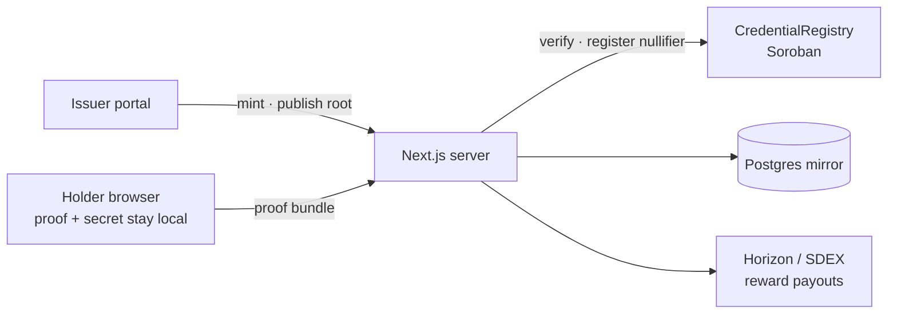
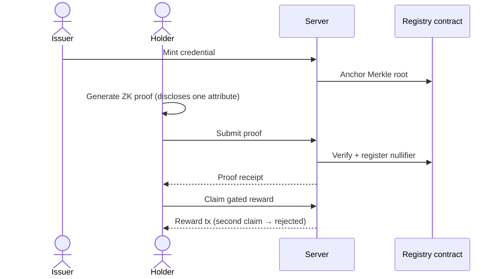
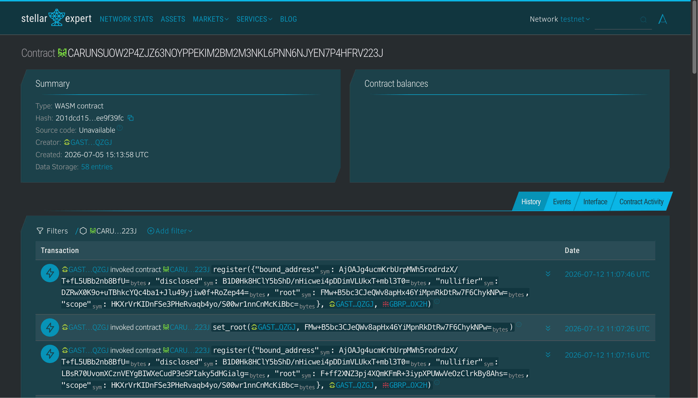
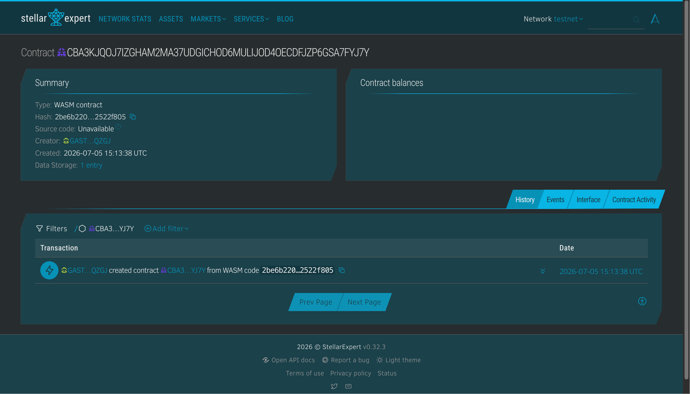

# Zelyo

> **Verifiable credentials, sealed with zero-knowledge proofs.** Prove one fact without revealing who you are.

Zelyo is a privacy-preserving credential protocol that lets issuers mint tamper-proof credentials, holders store them locally, and verifiers confirm specific claims — all without ever seeing the underlying personal data. Built on **Stellar Soroban** smart contracts and **Noir** zero-knowledge circuits, Zelyo turns sensitive credentials into selective, wallet-bound, Sybil-resistant reveals.

|             |                                                                                   |
| ----------- | --------------------------------------------------------------------------------- |
| **Status**  | v0.0.0 — pre-release |
| **License** | [LICENSE_PLACEHOLDER] |

---

## Pitch deck

A draft investor deck (MARP) lives at [`docs/pitch-deck.md`](docs/pitch-deck.md) — sized for a 3-minute pitch.

---

## 🧩 Problem

Identity verification today is broken:

- **Over-disclosure** — every job application, KYC check, or badge verification forces people to hand over full documents, resumes, or IDs.
- **Centralized honeypots** — platforms store mountains of PII that become breach targets.
- **Slow, expensive trust** — verifying a credential often means calling a third party, waiting for an email, or trusting a screenshot.
- **No user control** — once you share a PDF diploma or passport scan, you lose control over who sees it, forever.

For freelancers, professionals, and anyone crossing borders, the cost of proving you are qualified is privacy itself.

## 🌟 Vision

A world where credentials are **portable, private, and provable**. Zelyo replaces "trust me, here is everything" with "here is a cryptographic proof of exactly one fact" — bound to your wallet, user-controlled, and never tied to your name on-chain.

We believe the future of work needs an identity layer that is:

- **Self-sovereign** — the holder controls the secret.
- **Privacy-preserving** — only the disclosed attribute leaves the device.
- **Composable** — any issuer, any verifier, any reward gate.

## 🎯 Purpose

Built for the **Stellar Hackathon 2026**.

Zelyo exists to make privacy-preserving verification practical for real products. It gives developers, issuers, and platforms a full-stack starter kit for:

1. Issuing a credential and anchoring its Merkle root on-chain.
2. Letting a holder generate a zero-knowledge proof in their browser.
3. Verifying the proof server-side (or on-chain when supported).
4. Letting the holder claim a gated reward with that proof — without doxxing themselves.

The chain records only a **nullifier** and a **bound wallet address**. Your name, your full credential, and your secret never reach it.

## 👥 Target Users

- **Issuers** (universities, bootcamps, certifiers) — Mint fraud-resistant credentials and publish roots to a public registry without running a database of personal details.
- **Holders** (freelancers, remote workers, professionals) — Carry proof of skills in your wallet; reveal only what the opportunity requires.
- **Verifiers** (employers, marketplaces, DAOs) — Confirm claims cryptographically with no PII liability and no manual checks.
- **Developers** — Extend the protocol with new gates, credentials, and reward types using the ZK + Soroban scaffold.

## ✨ Features

- **Credential Lifecycle** — Issuer minting portal for Merkle tree leaves, Merkle-tree registry on Soroban with revocation/history, holder wallet with encrypted storage, and local secret management (IndexedDB, WebCrypto).
- **Zero-Knowledge Proving** — In-browser UltraHonk proofs via `@aztec/bb.js`/Noir, selective disclosure of `track`, address binding, and Sybil resistance (deterministic nullifiers).
- **Verification & Rewards** — Server-side verification (Path B), on-chain verification stub (Path A), and gated job board (claim token rewards or verified flags).
- **Hardening & Quality** — Security headers (CSP, COOP/COEP), rate limiting (Redis), PII-safe audit logging, accessibility compliance (WCAG 2.1 AA, Playwright + axe), and 290+ tests.

## 🏗️ Architecture

The secret `s` and the full credential never leave the holder's browser. The server sees only the disclosed attribute, a nullifier, and a bound wallet address. The chain sees nothing but hashes.





## 🚀 How to Run Locally

```bash
# 1. Clone
git clone [REPO_URL_PLACEHOLDER]
cd zelyo

# 2. Install deps (requires Node 22+ and pnpm 10.33.0)
pnpm install

# 3. Configure environment
cp .env.example .env
# Set the required values:
#   AUTH_SECRET=$(openssl rand -base64 48)
#   ADMIN_PASSWORD=<strong admin password>
#   ISSUER_SECRET=<S... issuer secret key>

# 4. Start backing services (Postgres + Redis + MinIO)
docker compose up -d

# 5. Migrate + seed the database
pnpm --filter @zelyo/web db:migrate
pnpm --filter @zelyo/web db:seed

# 6. Run the web app
pnpm dev
# → http://localhost:3000
```

Log in with `admin` / your `ADMIN_PASSWORD`.

> **Full developer reference** (scripts, env vars, branching, CI) lives further down in this README under [Developer reference](#developer-reference).

## 🌐 Deployment

Zelyo is deployed to **Stellar Testnet** and hosted on **Railway**. The network configuration is pinned at the environment level via `STELLAR_NETWORK` (staging/production = `testnet`).

### Testnet

Deployed via Railway from `develop` (auto-deploy on merge into `develop`).

- **App URL**: https://zelyo.one/
- **Credential Registry Contract**: [`CARUNSUOW2P4ZJZ63NOYPPEKIM2BM2M3NKL6PNN6NJYEN7P4HFRV223J`](https://stellar.expert/explorer/testnet/contract/CARUNSUOW2P4ZJZ63NOYPPEKIM2BM2M3NKL6PNN6NJYEN7P4HFRV223J)
- **Verifier Contract**: [`CBA3KJQOJ7IZGHAM2MA37UDGICHOD6MULIJOD4OECDFJZP6GSA7FYJ7Y`](https://stellar.expert/explorer/testnet/contract/CBA3KJQOJ7IZGHAM2MA37UDGICHOD6MULIJOD4OECDFJZP6GSA7FYJ7Y)
- **📸 Credential Registry Contract on Stellar Expert**:
  
- **📸 Verifier Contract on Stellar Expert**:
  

## 🎥 Demo

- 🔗 **Live App**: https://zelyo.one/
- 🎬 **Walkthrough Video**: `[VIDEO_URL_PLACEHOLDER]`
- 🖼️ **Pitch Deck**: `[DECK_URL_PLACEHOLDER]`

## 👨💻 Team

| Name | Role | GitHub |
| --- | --- | --- |
| Prince Jeffrey Villamil | software developer | [@princeVillamil](https://github.com/princeVillamil) |

## 📜 License

[LICENSE_PLACEHOLDER]

---

## Developer reference

### Stack at a glance

| Layer         | Tech                                                                          |
| ------------- | ----------------------------------------------------------------------------- |
| Runtime       | Node.js 22+, pnpm 10.33.0                                                     |
| Framework     | Next.js 16.2, React 19.2                                                      |
| UI            | TailwindCSS 4.3, shadcn/ui, lucide-react, framer-motion                        |
| Auth          | Auth.js v5 beta with credentials provider + Prisma adapter                   |
| DB            | PostgreSQL 16, Prisma 7.8, `@prisma/adapter-pg`                               |
| Cache / queue | Redis 7 (`ioredis`), `rate-limiter-flexible`                                  |
| Storage       | MinIO (dev) / S3-compatible bucket (prod)                                     |
| Blockchain    | Stellar / Soroban — `@stellar/stellar-sdk`                                    |
| Contracts     | Rust 1.92, `soroban-sdk` 26, `wasm32v1-none`                                  |
| Zero Knowledge| Noir 1.0.0-beta.22, `@noir-lang/noir_js`, `@aztec/bb.js`                      |

### Prerequisites

- Node.js `22+` and pnpm `10.33.0+`
- Docker + Docker Compose
- Rust `1.92+` with `wasm32v1-none` target
- Stellar CLI
- Noir (`nargo` 1.0.0-beta.22) and Barretenberg `bb` CLI — see [`docs/toolchain.md`](./docs/toolchain.md)

### Local services map

| Service  | Port(s)     | Notes                                              |
| -------- | ----------- | -------------------------------------------------- |
| Next.js  | 3000        | `pnpm dev`                                         |
| Postgres | 5432        | `zelyo / zelyo / zelyo`                            |
| Redis    | 6379        | —                                                  |
| MinIO    | 9000 / 9001 | console at `:9001`, `minioadmin / minioadmin`      |

### Scripts

#### App

| Script           | Purpose                                      |
| ---------------- | -------------------------------------------- |
| `pnpm dev`       | Start the Next.js dev server with HMR        |
| `pnpm build`     | Build the web app for production             |
| `pnpm start`     | Start the production Next.js server          |
| `pnpm typecheck` | Run TypeScript checks across the monorepo    |
| `pnpm lint`      | Lint all workspace packages                  |

#### Tests

| Script                    | Purpose                                          |
| ------------------------- | ------------------------------------------------ |
| `pnpm test`               | Run unit tests across all packages               |
| `pnpm test:e2e`           | Run Playwright end-to-end acceptance tests        |

#### Database

| Script                   | Purpose                              |
| ------------------------ | ------------------------------------ |
| `pnpm db:migrate`        | Run Prisma migrations in dev         |
| `pnpm db:seed`           | Seed the database                    |

#### Contracts (Soroban)

| Script                  | Purpose                                             |
| ----------------------- | --------------------------------------------------- |
| `pnpm contracts:build`  | Build Soroban contracts to WASM                     |
| `pnpm contracts:deploy` | Deploy contracts to Stellar testnet                 |

#### ZK Circuits

| Script                  | Purpose                                             |
| ----------------------- | --------------------------------------------------- |
| `pnpm zk:build`         | Compile Noir circuit and write verification key     |

### Project layout

```
apps/
  web/                  Next.js web application
    prisma/             Prisma schema, migrations, and seed scripts
    public/circuit/     Compiled ZK circuit artifacts (verification key, bytecode)
    src/
      app/              App Router pages (issuer portal, holder wallet, result views)
      components/       Reusable React components
      lib/              Shared helper utilities (stellar client, rate limiters)
      server/           Domain services (verification, sep12, sep8)
    tests/              Vitest unit and Playwright e2e suites
packages/
  zk-shared/            Workspace package for Poseidon2 math and contract client types
contracts/
  credential_registry/  Soroban credential registry smart contract (enforces roots/nullifiers)
  verifier/             Soroban ZK verifier contract (Path A verification stub)
circuits/               Noir zero-knowledge circuit source code
scripts/                Contract deployment and ZK build tooling
docs/                   Runbooks, feature changelogs, and toolchain guides
```

### Branching & CI

| Branch                  | Role                                       |
| ----------------------- | ------------------------------------------ |
| `main`                  | Production-ready; protected.               |
| `develop`               | Integration branch; all PRs merge here.    |
| `feat/*`, `fix/*`, …    | Short-lived feature branches.              |

CI (`.github/workflows/ci.yml`) runs on push and PR to develop:

- **node** lane — installs dependencies, lints, typechecks, runs unit tests, builds the web app, checks dependencies.
- **e2e** lane (`e2e.yml`) — runs end-to-end integration tests, migrates/seeds DB, and runs Playwright specs.

### Environment variables

`.env.example` is the source of truth — copy it and fill the marked secrets. The shape:

- **Core** — `NODE_ENV`, `APP_URL`, `LOG_LEVEL`
- **Auth** — `AUTH_SECRET`, `AUTH_URL`, `AUTH_TRUST_HOST`
- **Database** — `DATABASE_URL`, `DIRECT_URL`
- **Redis** — `REDIS_URL`
- **Object Storage** — `S3_ENDPOINT`, `S3_REGION`, `S3_BUCKET`, `S3_ACCESS_KEY_ID`, `S3_SECRET_ACCESS_KEY`, `S3_FORCE_PATH_STYLE`
- **Stellar** — `STELLAR_NETWORK`, `NETWORK_PASSPHRASE`, `SOROBAN_RPC_URL`, `HORIZON_URL`, `ISSUER_SECRET`, `CREDENTIAL_REGISTRY_CONTRACT_ID`, `VERIFIER_CONTRACT_ID`
- **ZK** — `ZK_SCOPE_APP_ID`, `ZK_VERIFY_MODE`, `CIRCUIT_ARTIFACT_BASE`
- **SEP-10** — `SEP10_HOME_DOMAIN`, `SEP10_SIGNER_SECRET`, `SEP10_CHALLENGE_TTL_SECONDS`, `SEP10_JWT_MAX_AGE_SECONDS`, `SEP10_JWT_SECRET`
- **Passkey-kit** — `NEXT_PUBLIC_PASSKEY_KIT_RPC_URL`, `NEXT_PUBLIC_PASSKEY_KIT_NETWORK_PASSPHRASE`, `NEXT_PUBLIC_PASSKEY_KIT_WALLET_WASM_HASH`
- **OpenZeppelin Stellar Channels** — `USE_CHANNELS`, `CHANNELS_URL`, `CHANNELS_API_KEY`
- **Feature gates** — `NEXT_PUBLIC_SEP45_ENABLED`
- **Seed** — `ADMIN_USERNAME`, `ADMIN_PASSWORD`, `ISSUER_NAME`, `ISSUER_STELLAR_ACCOUNT`

> **Never** put a Stellar secret key (like `ISSUER_SECRET`) in public client variables. No secret variable uses the `NEXT_PUBLIC_` prefix.

### Deployment infrastructure

- Deployed via **Railway** utilizing `railway.json` and `nixpacks.toml`.
- Standalone Next.js bundle is built with `pnpm build`.
- Migration/seed are automatically run via `preDeployCommand` using `prisma migrate deploy` and `prisma db seed`.
- Production build runs via `pnpm start`.

### Further reading

- [`SPEC.md`](./SPEC.md) — full product and architecture spec
- [`docs/features.md`](./docs/features.md) — running feature log
- [`docs/DEPLOY.md`](./docs/DEPLOY.md) — Railway deploy and contract guides
- [`docs/toolchain.md`](./docs/toolchain.md) — toolchain configuration guides
